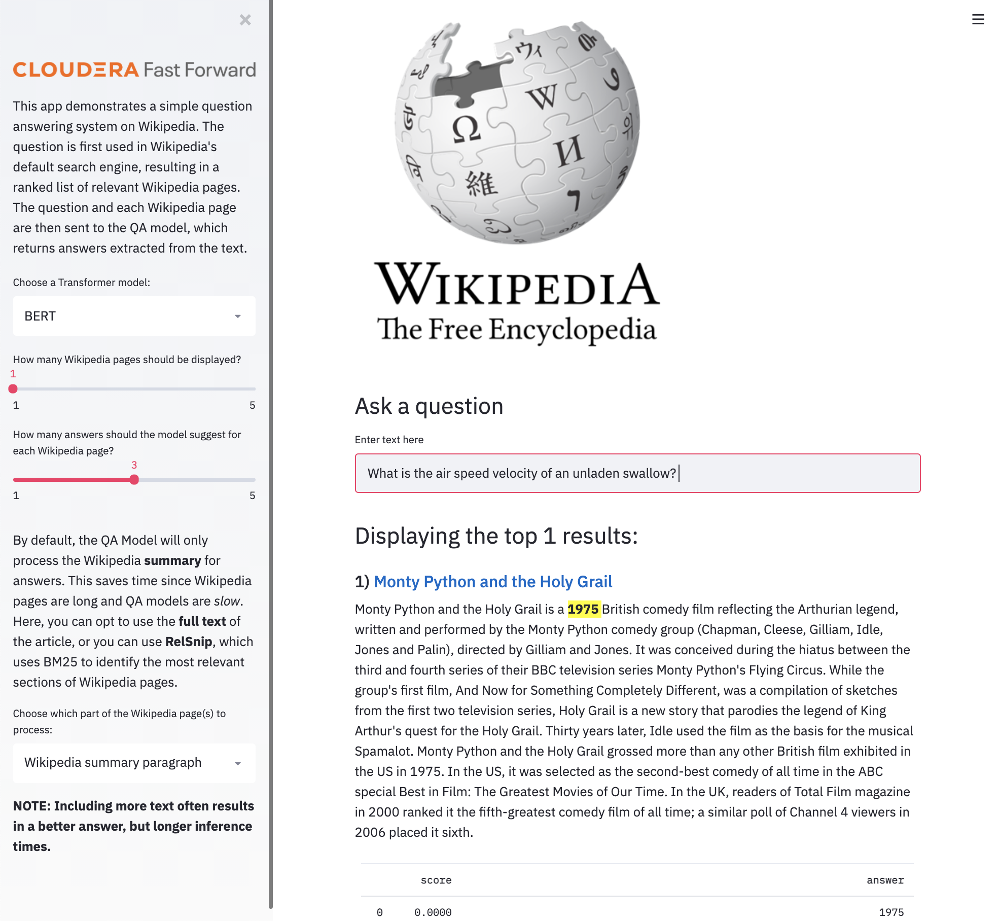
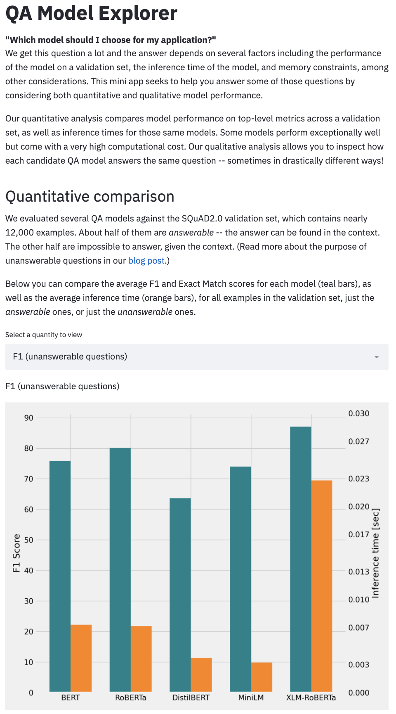
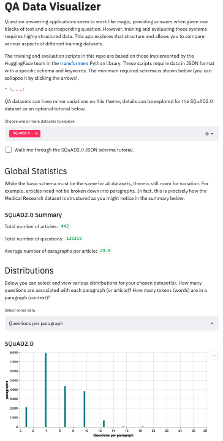

# Deep Learning for Question Answering
This repo accompanies Cloudera Fast Forward's [Question Answering blog series](https://qa.fastforwardlabs.com/) in which each blog post dives deep into various aspects of modern question answering systems. For a high level introduction to QA systems in general, including the Information-Retrieval (IR) based system included here, check out [this post](https://qa.fastforwardlabs.com/methods/background/2020/04/28/Intro-to-QA.html). 

The primary outputs of this repository are three small applications that allow the user to experience an end-to-end extractive question answering system, as well as interact with the data and models that support such a system. Each application is briefly described in turn below. 

### WikiQA
The WikiQA application is a functioning IR-QA system built on top of Wikipedia's search engine and makes use of pre-trained Transformer models from the [HuggingFace library](https://huggingface.co/transformers/). 


### Model Explorer
The Model Explorer application allows users to compare several pre-trained QA models against various performance measures in an interactive and educational manner.


### Data Visualizer
The Data Visualizer helps users to visually understand the structure required to train and evaluate Transformer neural networks for the task of question answering.



Instructions are given both for general use (on a laptop, say), and for Cloudera CML and CDSW.
We'll first describe what's here, then go through how to run everything.

## Structure

The folder structure of the repo is as follows

```
.
├── apps      # Three small Streamlit applications.
├── cml       # Contains scripts that facilitate the project launch on CML.
├── data      # Contains pre-computed evaluation data required for the apps. Starter data will also be downloaded here during project launch on CML.
├── scripts   # This is where all the code that does something lives.
└── qa        # A small library of useful functions.
```

There is also an `images` folder that contains images for this README, which can be ignored.
Let's examine each of the important folders in turn.

### `apps`
The three applications accompanying this repository are the primary features of this project. Each comes with a launcher script to assist deployment as an application on CML. To launch the applications in another environment, run the code inside the launcher file, with the prefixed `!` removed. You also may need to specify different ports.

### `cml`
These scripts serve as launch tasks to facilitate the automated project setup on CML. Each script is triggered by the declarative pipeline as defined in the `.project-metadata.yaml` file found in the project's root directory.

```
cml
├── install_dependencies.py
└── download_data_and_models.py
```

The three applications feed off of two different open-source QA datasets, as well as five different pre-trained QA models. `download_data_and_models.py` ensures that these datasets and models are immediately available once the automated project setup on CML has completed.

If you are performing manual setup of this repo, you can either run that script explicitly, or simply start using the apps as intended. The functions are designed such that, if a model is called that has not yet been downloaded, the code will automatically initiate a model download. (Note: only models are automatically downloaded on-the-fly. Datasets must be downloaded manually; a process described below.) 

### `qa`
This is a small Python library designed for practioners who want to train and evaluate Transformer models for question answering tasks. This library is not largely used by any of the three apps mentioned above, however detailed instructions for its usage are provided in [this document](https://github.com/fastforwardlabs/question_answering/blob/master/scripts/README.md).

Its structure is as follows:
```
qa
├── data
│   ├── fetch.py     
│   ├── loader.py
│   ├── processing.py
│   └── utils.py
├── arguments.py
├── model_utils.py
└── utils.py
```

### `scripts`
The scripts contained here are to be used in conjunction with the `qa` library above and facilitate high level tasks needed to train and evaluate a custom QA model. As mentioned above, detailed instructions for these scripts and the `qa` module are contained in [this document](https://github.com/fastforwardlabs/question_answering/blob/master/scripts/README.md) that accompanies the scripts directory.

```
scripts
├── README.md
├── config.txt
├── config_multi-train.py
├── evaluate.py
├── model.py
├── multi-train.py
└── train.py
```

### `data`
The apps and scripts designed to work with the `qa` library make use of two open source question answering datasets. 

* [SQuAD2.0](https://rajpurkar.github.io/SQuAD-explorer/) is a canonical QA dataset that is the current benchmark against which most modern QA models are evaluated. 
* [COVID-QA](https://github.com/deepset-ai/COVID-QA) is a smaller dataset of medical research papers and questions focused on the novel coronavirus. 


## Deploying on CML
There are three ways to launch this project on CML:

1. **From Prototype Catalog** - Navigate to the Prototype Catalog on a CML workspace, select the "Deep Learning for Question Answering" tile, click "Launch as Project", click "Configure Project"
2. **As ML Prototype** - In a CML workspace, click "New Project", add a Project Name, select "ML Prototype" as the Initial Setup option, copy in the [repo URL](https://github.com/fastforwardlabs/question_answering), click "Create Project", click "Configure Project"
3. **Manual Setup** - In a CML workspace, click "New Project", add a Project Name, select "Git" as the Initial Setup option, copy in the [repo URL](https://github.com/fastforwardlabs/question_answering), click "Create Project". Launch a Python3 Workbench Session with at least 8GB of memory and 2vCPUs. Then follow the Installation instructions above.

### Installation
The code and applications within were developed against Python 3.6.9, and are likely also to function with more recent versions of Python.

To install dependencies, first create and activate a new virtual environment through your preferred means, then pip install from the requirements file. I recommend:

```python
python3 -m venv .venv
source .venv/bin/activate
pip install -r requirements.txt
python3 cml/download_data_and_models.py
```

In CML or CDSW, no virtual env is necessary. Instead, inside a Python 3 session (with at least 2 vCPU / 8 GiB Memory), simply run

```python
!pip3 install -r requirements.txt       # notice `pip3`, not `pip`
!python3 cml/download_data_and_models.py    # download all datasets and models    
```

Note: the `cml/download_data_models.py` script downloads five Transformer models and two open-source datasets. Transformer models are quite large so this can take several minutes to complete. Because these models can instead be downloaded on-the-fly while using the apps, this step can be skipped. However, you **must** download the data!  To download *just* the data (and not the models), start a python terminal or CML/CDSW Session and perform the following: 

```python
from qa.data.fetch import download_squad, download_covidQA
download_squad(version=2)
download_covidQA()
```

### Starting the Applications
As mentioned earlier, each application comes with a launcher scripts to assist launching an application on CML. However, you can also launch the applications from a Session or in another environment altogether.

For example, to launch WikiQA in a CML/CDSW session use

`!streamlit run apps/wikiqa.py  --server.port $CDSW_APP_PORT --server.address 127.0.0.1`

> Note: This is the same as executing the launch script itself.

In a local environment (your laptop, say), you can instead simply call

`streamlit run apps/wikiqa.py`

-------------------------
